# RedHat ex280
Red Hat Certified OpenShift Administrator exam (EX280) Overview and Preparation. 

Sections:

- [Red Hat OpenShift Platform Architecture](#Red-Hat-OpenShift-Platform-Architecture)
- [Red Hat OpenShift Editions](#Red-Hat-OpenShift-Editions)
- [Red Hat OpenShift Installation](#Red-Hat-OpenShift-Installation)
- [Red Hat Openshift Networking](#red-hat-openshift-networking)
- [Red Hat Certified OpenShift Administrator exam](#Red-Hat-Certified-OpenShift-Administrator-exam)

## Red Hat OpenShift Platform Architecture

The following diagram shows the high-level stack that comprises a Red Hat OpenShift Container Platform (RHOCP) deployment.

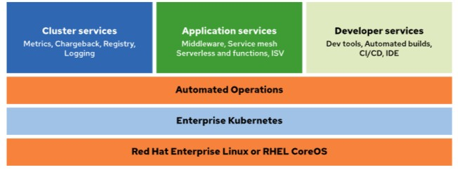

### Red Hat OpenShift Platform Architecture Overview

The RHOCP architecture begins with the Red Hat CoreOS or Red Hat Enterprise Linux operating systems. By using machines that run one of these operating systems, RHOCP provides the necessary cluster features to deliver the container platform. Additional automated operations continue to build on Kubernetes to deliver an enterprise-class container environment.

Cluster services, such as metrics, a container image registry, and event logging deliver additional features for the environment. Container images are the collection of defined containers that are available within the cluster for deployment. Application services, such as service mesh and other middleware, are also available within the cluster. Additionally, the cluster contains developer services to aid the ongoing application development and platform administration.

The full stack of an RHOCP cluster delivers not only a container runtime environment, but also the additional required tools in enterprise-class deployments to perform the full set of tasks that a modern business application platform requires.

### Components of the RHOCP Stack

#### 1. Red Hat Enterprise Linux (RHEL) or RHEL CoreOS
- **Description**: This is the foundational layer of the stack, providing the underlying operating system on which the OpenShift Container Platform runs. It includes:
  - **RHEL**: A robust and secure Linux distribution tailored for enterprise use.
  - **RHEL CoreOS**: A lightweight, container-optimized version of RHEL specifically designed to run containerized applications efficiently.
- **Role**: Provides the necessary infrastructure and environment for deploying and managing containers and orchestrating them with Kubernetes.

#### 2. Enterprise Kubernetes
- **Description**: This layer represents the core Kubernetes functionality enhanced for enterprise use. Kubernetes is an open-source platform designed to automate deploying, scaling, and operating application containers.
- **Role**: Provides container orchestration capabilities, including scheduling, scaling, and managing containerized applications. It ensures high availability, fault tolerance, and efficient resource utilization within the cluster.

#### 3. Automated Operations
- **Description**: This layer includes tools and features for automating the deployment, management, monitoring, and scaling of applications within the OpenShift environment.
- **Role**: Facilitates the operational tasks associated with managing a containerized environment. It ensures smooth and efficient management of the infrastructure, reducing manual intervention and increasing reliability and performance.

#### 4. Cluster Services
- **Components**:
  - **Metrics**: Collects and stores metrics data from the cluster to monitor performance and resource utilization.
  - **Chargeback**: Provides mechanisms for tracking resource usage and cost allocation for billing purposes.
  - **Registry**: A container image registry to store and manage container images used for deployments within the cluster.
  - **Logging**: Captures and stores logs from applications and system components for troubleshooting and analysis.
- **Role**: Provides essential services that enhance the functionality and manageability of the cluster, ensuring it meets enterprise requirements.

#### 5. Application Services
- **Components**:
  - **Middleware**: Provides essential software components like application servers, messaging systems, and databases that support application development and deployment.
  - **Service Mesh**: Facilitates the management, security, and observability of microservices within the cluster.
  - **Serverless and Functions**: Supports serverless computing and functions as a service (FaaS) for building scalable and event-driven applications.
  - **ISV (Independent Software Vendor)**: Integration with third-party applications and services.
- **Role**: Enhances the capabilities of the platform by offering additional services that support the development, deployment, and management of applications.

#### 6. Developer Services
- **Components**:
  - **Dev Tools**: Includes integrated development environments (IDEs), command-line tools, and other utilities to support developers.
  - **Automated Builds**: Automates the process of building container images from application source code.
  - **CI/CD**: Continuous Integration and Continuous Deployment tools to automate the testing and deployment of applications.
  - **IDE**: Integrated Development Environment for easier coding and debugging.
- **Role**: Provides tools and services that streamline the development process, improving developer productivity and facilitating continuous delivery and integration practices.

Openshift, as a container Platform, includes many critical components for monitoring, automation and scaling. Take a look at the refernce image below for more details

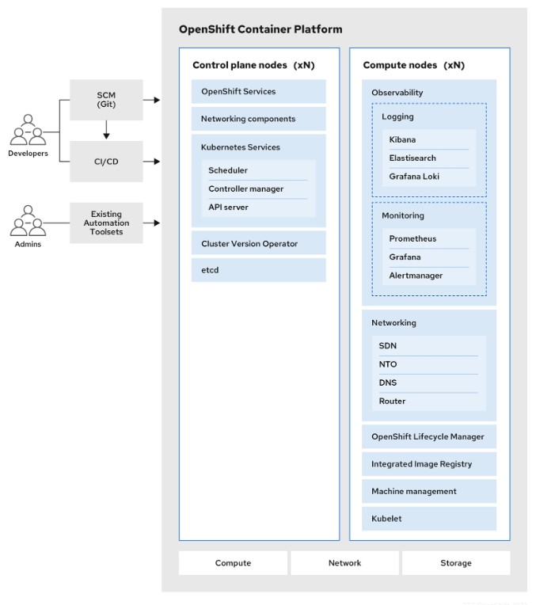

## Red Hat OpenShift Editions

After choosing RedHat Openshift as the container orchastrator for your Business Application, the next step is chosing the edition you will implement. Here is a list of alternatives as of Openshift 4.14

#### Red Hat OpenShift Local
- Deploys a cluster on a local computer for testing and exploration.
- Suitable for initial exploration of OpenShift.
- Not intended for production environments.

#### Red Hat Developer Sandbox
- Provides 30 days of free access to a shared OpenShift cluster.
- Allows testing and exploration of OpenShift features.
- Not intended for production use.

#### Public Cloud Managed Services
- Quick access to OpenShift clusters on Amazon Web Services, Microsoft Azure, IBM Cloud, and Google Cloud.
- Managed by Red Hat and cloud providers, integrating with cloud infrastructure.
- Ideal for businesses seeking reliable and managed cluster deployments.

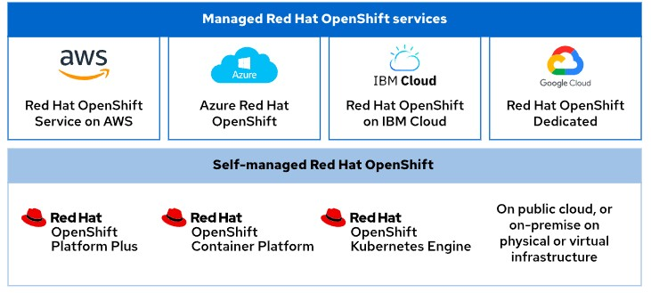

#### Self-Managed Editions
- Deployable on physical or virtual infrastructure, on-premise or in a public cloud.
- Offers greater control and flexibility but requires more management responsibility.
- Suitable for organizations that prefer to manage their own infrastructure and cluster services.

#### Red Hat OpenShift Kubernetes Engine
- Includes the latest Kubernetes platform with enhanced security and enterprise stability.
- Runs on Red Hat Enterprise Linux CoreOS and includes Red Hat OpenShift Virtualization.
- Provides an administrator console for operational support.

#### Red Hat OpenShift Container Platform
- Builds on the OpenShift Kubernetes Engine with additional manageability, security, and development features.
- Includes a developer console, log management, cost management, and metering information.
- Adds Red Hat OpenShift Serverless (Knative), Service Mesh (Istio), Pipelines (Tekton), and GitOps (Argo CD).

#### Red Hat OpenShift Platform Plus
- The most feature-rich edition, including all features of the Container Platform.
- Adds Red Hat Advanced Cluster Management, Advanced Cluster Security, and Red Hat Quay private registry.
- Designed for comprehensive development and administrative needs for containerized application management.

#### Red Hat Insights Advisor
- Available through the Red Hat Hybrid Cloud Console.
- Helps administrators identify and remediate cluster issues using data from the Insights Operator.
- Provides recommendations and their impacts on the cluster for proactive management.


## Red Hat Openshift Networking

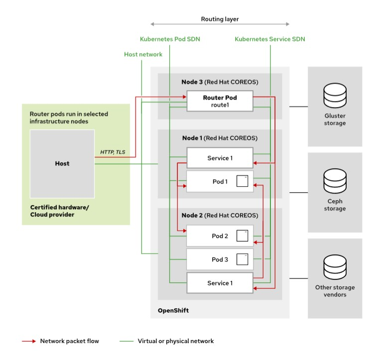

### Software-Defined Networks in OpenShift

#### The Software-Defined Network
Kubernetes implements software-defined networking (SDN) to manage the network infrastructure of the cluster and user applications. The SDN is a virtual network that encompasses all cluster nodes. The virtual network enables communication between any container or pod inside the cluster. Cluster node processes that Kubernetes pods manage can access the SDN. However, the SDN is not accessible from outside the cluster, nor to regular processes on cluster nodes. With the software-defined networking model, you can manage network services through the abstraction of several networking layers.

#### Managing Network Traffic and Resources
With the SDN, you can manage the network traffic and network resources programmatically, so that the organization teams can decide how to expose their applications. The SDN implementation creates a model that is compatible with traditional networking practices. It makes pods akin to virtual machines in terms of port allocation, IP address leasing, and reservation.

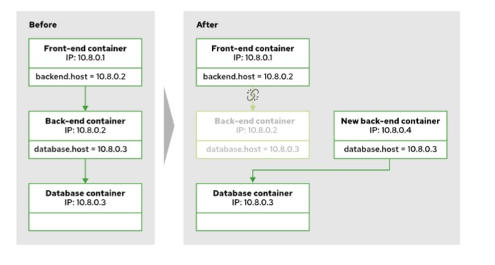

#### Compatibility with Traditional Networking Practices
With the SDN design, you do not need to change how application components communicate with each other, which helps to containerize legacy applications. If your application is composed of many services that communicate over the TCP/UDP stack, then this approach still works, because containers in a pod use the same network stack.

### Kubernetes Networking Drivers and Red Hat OpenShift Cluster

#### Kubernetes Networking Drivers
Container Network Interface (CNI) plug-ins provide a common interface between the network provider and the container runtime. CNI defines the specifications for plug-ins that configure network interfaces inside containers. Plug-ins that are written to the specification enable different network providers to control the RHOCP cluster network.


#### Red Hat Provided CNI Plug-ins
Red Hat provides the following CNI plug-ins for an RHOCP cluster:

- **OVN-Kubernetes**: The default plug-in for first-time installations of RHOCP, starting with RHOCP 4.10.
- **OpenShift SDN**: An earlier plug-in from RHOCP 3.x; it is incompatible with some later features of RHOCP 4.x.
- **Kuryr**: A plug-in for integration and performance on OpenStack deployments.

Certified CNI plug-ins from other vendors are also compatible with an RHOCP cluster.

#### Functionality of CNI Plug-ins
The SDN uses CNI plug-ins to create Linux namespaces to partition the usage of resources and processes on physical and virtual hosts. With this implementation, containers inside pods can share network resources, such as devices, IP stacks, firewall rules, and routing tables. The SDN allocates a unique routable IP to each pod, so that you can access the pod from any other service in the same network.

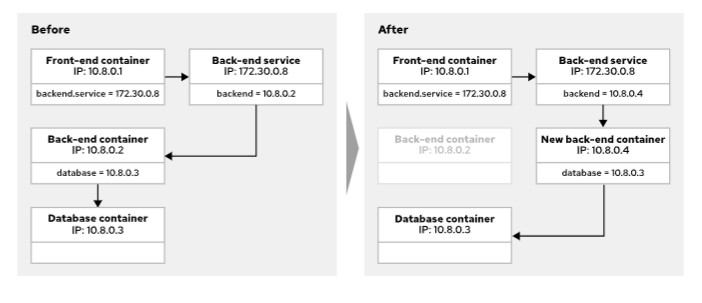

#### OVN-Kubernetes in OpenShift
In OpenShift 4.14, OVN-Kubernetes is the default network provider.

OVN-Kubernetes uses Open Virtual Network (OVN) to manage the cluster network. A cluster that uses the OVN-Kubernetes plug-in also runs Open vSwitch (OVS) on each node. OVN configures OVS on each node to implement the declared network configuration.

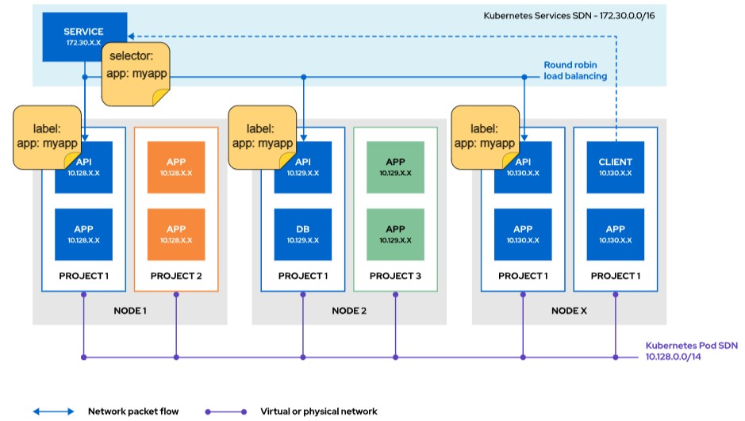

## Red Hat OpenShift Installation

For this guideline, I will explain local RedHat Openshift installation using CRC (CodeReadyContainers). For Managed services (e.g ROSA) please refer to my previous blog entry: 

CodeReady Containers:

1. Brings a minimal Openshift 4 cluster to your laptop/Desktop for developing and testing.
2. The CLI makes it easy to install and interact with the VM. It also allows for easy configuration.
3. Since CRC is ephemeral, it's intended only for learning purposes. Refrain from running it in production ;)

### Requirements

1. vCPU -> At least 4vCPUs
2. Memory -> At least 9GBi of free memory
3. Storage -> At least 35GB of free storage
4. RedHat Openshift Console Account -> https://console.redhat.com/openshift
5. CRC pull secret -> Also called: Red Hat Openshift Local Secret. You can download this from item 4. Refer to below image for further details


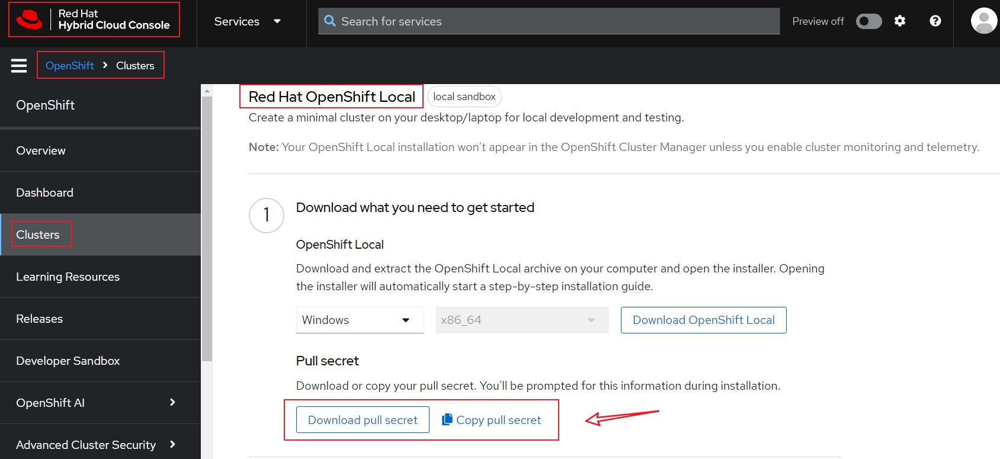

### Steps

Note: I will show the setps for a Windows OS. Please refer to official documentation for Linux/MAC OS

1. Download latest CRC release https://cloud.redhat.com/openshift/install/crc/installer-provisioned
2. (optional) add the path to environment variables
3. Go to the CRC folder and run: `crc setup`
4. When requested, paste the CRC pull secret code mentioned in the requirements section.
5. Once completed the setup, execute the `crc start`
6. Wait until installation is commpleted. Credentials information will be displayed.
7. In case you need to collect login information, use `crc console --show-credentials`
8. If you need to access UI, use `crc console`
9. OCP cluster is ready to use!!

CRC Setup
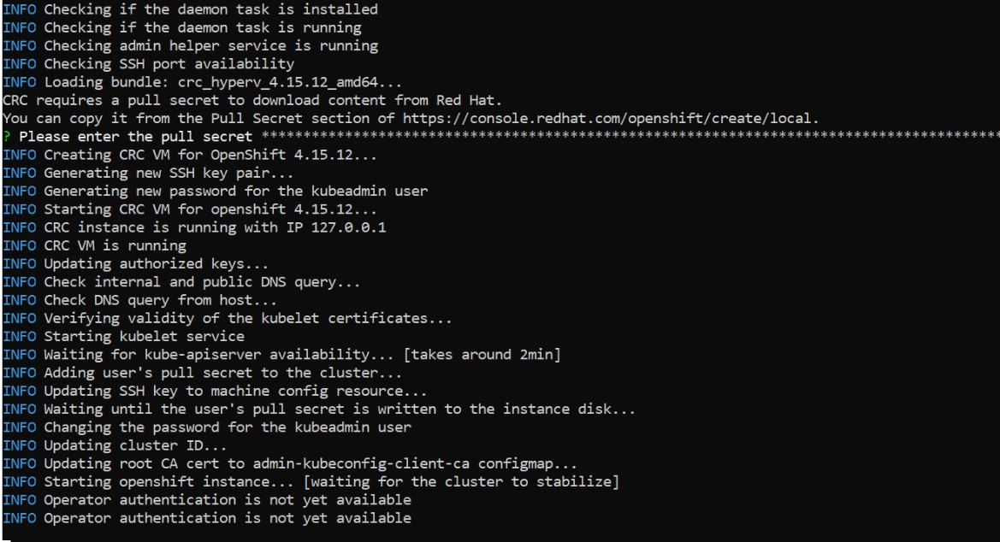


CRC start completed and cluster ready to use

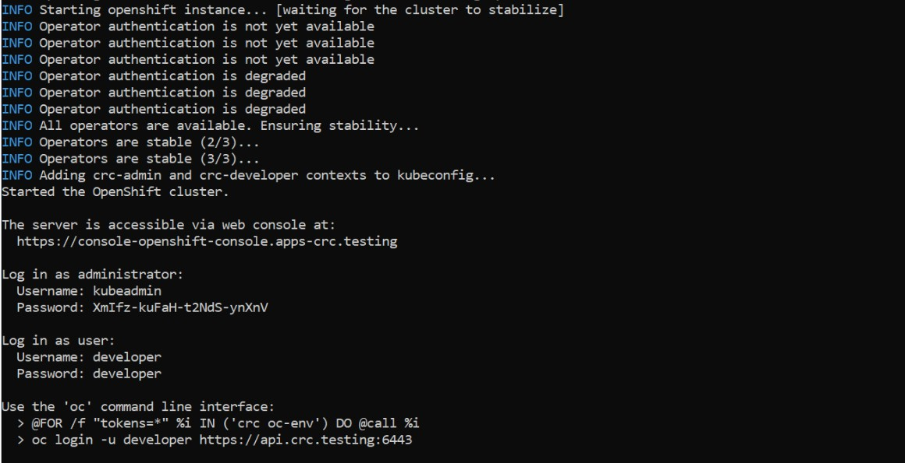


## Red Hat Certified OpenShift Administrator exam

### General Information

The **Red Hat Certified OpenShift Administrator exam (EX280)** 🛠️ tests your ability to set up, configure, and manage applications on the Red Hat OpenShift Container Platform 🚀, a cloud-based system for running applications in containers 📦.

Passing this exam makes you a **certified Red Hat OpenShift Administrator** 🏅 and helps you on your way to becoming a **Red Hat Certified Architect (RHCA)** 🌟.

The exam is designed for:

- **System and Software Architects** 🖥️ needing to understand OpenShift features and functionality.
- **System Administrators** 👩‍💻 setting up initial OpenShift clusters.
- **Cluster Operators** 🔧 handling ongoing maintenance of OpenShift clusters.
- **Site Reliability Engineers** 🛡️ troubleshooting and maintaining OpenShift clusters.
- **System Administrators** 💼 wanting to showcase their OpenShift skills.
- **Red Hat Certified Engineers** 🎓 aiming to become RHCA.
- **System Administrators or Developers** 👨‍💻 working in DevOps environments with OpenShift.


### Recommended Links

I created this blog to talk about certain topics I found difficult to practice due to limited online resources. For General Exam details and a broad range of core concepts I recommend the following:

1. RedHat
  - Red Hat OpenShift Administration I: Containers & Kubernetes (DO180) course [Link here](https://www.redhat.com/en/services/training/red-hat-openshift-administration-i-operating-a-production-cluster)
 
  - Red Hat OpenShift Administration II: Operating a Production Kubernetes Cluster (DO280) course   [Link here](https://www.redhat.com/en/services/training/red-hat-openshift-administration-ii-configuring-a-production-cluster) 

Official documentation offered by Red Hat. Includes both Theory and detailed Hands-on exercises. Totally recommended.

2. Youtube
  - Openshift Administration series - [Tech Tejendra](https://www.youtube.com/watch?v=ElhpkEaAM5Y&list=PLnFCwVWiQz4nFE9X6ADRTtBvZDIrIAL1u)
 
  - Openshift series - [Devops](https://www.youtube.com/watch?v=aJqyGdv7h68&list=PLt-VlKXeX8qvgkn5BG26zfXYBIuiwtHqq)
  

  Hands on Youtube series to follow along with CRC. Also recommended and In my opinion, together cover 50-60% Exam topics

3. Blog

  - https://www.enoks.fr/openshift/EX280/#manage-openshift-container-platform 

  Detailed Enok Doc with Openshift EX280 topics and examples. Great for last minute review and learn some services you won't find in Youtube series.

### Container Troubleshooting Overview

Containers are designed to be immutable and ephemeral. A running container must be redeployed when changes are needed or when a new container image is available. However, you can change a running container without redeployment.

Updating a running container is best reserved for troubleshooting problematic containers. Red Hat does not generally recommend editing a running container to fix errors in a deployment. Changes to a running container are not captured in source control, but help to identify the needed corrections to the source code for the container functions. Capture these container updates in version control after you identify the necessary changes. Then, build a new container image and redeploy the application.

Custom alterations to a running container are incompatible with elegant architecture, reliability, and resilience for the environment.

### CLI Troubleshooting Tools
Administrators use various tools to interact with, inspect, and alter running containers. Administrators can use commands such as `oc get` to gather initial details for a specified resource type. Other commands are available for detailed inspection of a resource, or to update a resource in real time.

**NOTE**: When interacting with the cluster containers, take suitable precautions with actively running components, services, and applications.

Use these tools to validate the functions and environment for a running container:

The `oc` CLI provides the following commands:
- `oc describe`: Display the details of a resource.
- `oc edit`: Edit a resource configuration by using the system editor.
- `oc patch`: Update a specific attribute or field for a resource.
- `oc replace`: Deploy a new instance of the resource.
- `oc cp`: Copy files and directories to and from containers.
- `oc exec`: Execute a command within a specified container.
- `oc explain`: Display documentation for a specified resource.
- `oc port-forward`: Configure a port forwarder for a specified container.
- `oc logs`: Retrieve the logs for a specified container.

Besides supporting the previous `oc` commands, the `oc` CLI adds the following commands for inspecting and troubleshooting running containers:
- `oc status`: Display the status of the containers in the selected namespace.
- `oc rsync`: Synchronize files and directories to and from containers.
- `oc rsh`: Start a remote shell within a specified container.

### Practice Exams

Find the following Practice Exams to review core concepts and challenge yourself while preparing for the exam:

#### Practice Exam LVL1

##### Set Up htpasswd as the Identity Provider and Add Users and Permissions

1. Set up the htpasswd file.
2. Verify the file contents.
3. Set up the rest of the users and their passwords.
4. Verify the file contents.
5. Check if there's an existing HTPasswd Secret file.
6. Delete the `htpass-secret` file.
7. Create the secret from the htpasswd file.
8. Download the HTPasswd Custom Resource.
9. Open the file.
10. Under `identityProviders`, replace `my_htpasswd_provider` with `users.htpassword`.
11. Save and exit the file by pressing `Escape` followed by `:wq`.
12. Apply the changes.
13. Log in as the `root` user.
14. Verify you're logged in as `root`.
15. Log in as the `alpha` user.
16. Verify you're logged in as `alpha`.
17. Log in as the `beta` user.
18. Verify you're logged in as `beta`.
19. Log in as the `gamma` user.
20. Verify you're logged in as `gamma`.
21. Log in as the `delta` user.
22. Verify you're logged in as `delta`.
23. Log in as `kubeadmin`.
24. Create the `NewProject` project.
25. Give `alpha` admin permissions to the `NewProject` project.
26. Give `beta` and `gamma` edit permissions to the `NewProject` project.
27. Give `delta` basic user permissions to the `NewProject` project.
28. Give the `root` user cluster admin permissions.
29. Log in as `root`.
30. Remove the `kubeadmin` user from the cluster.

##### Role-Based Access and Groups

31. Create a project called `snacks`.
32. Create a group called `group1`.
33. Add `alpha`, `beta`, and `gamma` to the `group1` group.
34. Grant admin access to the `group1` group for the project `snacks`.
35. Create a custom `getpods` role.
36. Assign the `getpods` role to `delta`, allowing the user to get pod information from the `snacks` project.
37. Verify it worked.

##### Quotas and Resource Limits

38. Download the quota and resource limit templates, modify them to limit cpu and memory for `snacks` project.

#### Practice Exam LVL2

1. Create a network policy to only allow ingress traffic from an specific namespace, pod label and port. Refer to below YAML file for reference

```
kind: NetworkPolicy
apiVersion: networking.k8s.io/v1
spec:
  podSelector:
    matchLabels:
      deployment: hello
  ingress:
    - from:
      - namespaceSelector:
          matchLabels:
            network: different-namespace
        podSelector:
          matchLabels:
            deployment: sample-app
      ports:
      - port: 8080
        protocol: TCP

```
2. Create a network policy that allows traffic to the hello pod via the exposed route

3. Create cluster logs to upload for support

## Next Steps

Thank you for taking the time to read this summary and tips on the Red Hat EX280 exam! 📚 As with any hands-on exam, the key is consistent practice and exploring different ways to solve problems or deliver solutions. In my experience, that's the best way to truly understand and master a concept. Keep rocking and happy learning! 🚀💡

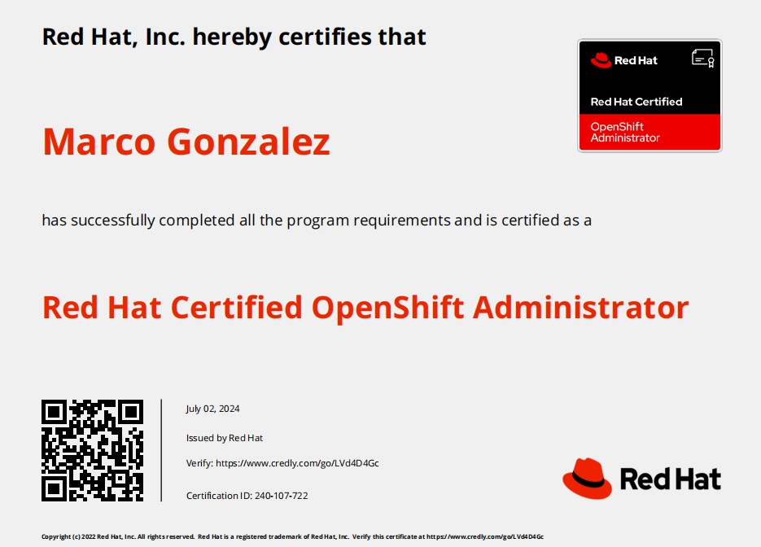
